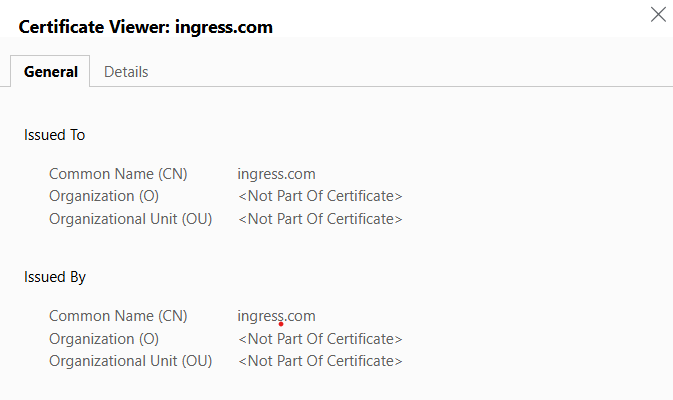

- #### Deployment of a staged application with Helm

  - ##### Pull the current status of GIT in respective branch:
```bash
git Pull
```

  - ##### Switch to respective develop (e.g.) branch:
```bash
git switch develop
```

  - ##### Check which git branches are available:
```bash
git branch
```
  - ##### Create a new branch (e.g. feature) and navigate to it:
```bash
git checkout -b feature
```
  - ##### Add a new file in the branch:
```bash
git add .
```
  - ##### Commit the added file:
```bash
git commit -m "this is a sample commit"
```
  - ##### Push the local feature branch to remote:
```bash
git push -u origin feature
```
  - ##### Then checkout the master branch:
```bash
git checkout master
```
  - ##### Then merge the updates to master branch:
```bash
git merge feature
```
  - ##### Then push local master branch to remote:
```bash
git push -u origin master
```

  - ##### Create helm chart:
```bash
helm create myk8sapp
```

  - ##### Helm install command to install myk8sapp-v1.0 in directory myk8sapp/ and in k8s namespace test
```bash
helm install myk8sapp-v1.0 myk8sapp/ -n test
```

  - ##### Helm upgrade command to upgrade the installed helm application:
```bash
helm upgrade myk8sapp-v1.0 myk8sapp/ -n test
```

  - ##### Helm template command to check if templating is right without changing in practical:
```bash
helm template ./myk8sapp --debug
```

  - ##### Helm install command with to use one base value file and to override some values from a env specific value file
```bash
helm install myk8sapp-dev-v1.0 myk8sapp/ --values myk8sapp/values.yaml -f myk8sapp/values-dev.yaml -n dev
helm install myk8sapp-prod-v1.0 myk8sapp/ --values myk8sapp/values.yaml -f myk8sapp/values-dev.yaml -n prod
```

  - ##### Helm upgrade command with to use one base value file and to override some values from a env specific value file
```bash
helm upgrade myk8sapp-dev-v1.0 myk8sapp/ --values myk8sapp/values.yaml -f myk8sapp/values-dev.yaml -n dev
helm upgrade myk8sapp-prod-v1.0 myk8sapp/ --values myk8sapp/values.yaml -f myk8sapp/values-dev.yaml -n prod
```
  - ##### Helm install command for installation of kube-prometheus stack operator
```bash
helm install prometheus prometheus-community/kube-prometheus-stack     #Here "prometheus" is used as RELEASENAME
```

  - ##### Helm command for installation of Prometheus Exporter of MongoDB (with overriding of some default values)
```bash
helm install prometheus-exporter prometheus-community/prometheus-mongodb-exporter --values myk8sapp/values-mongodb-exporter.yaml 

#Here "prometheus-exporter" is used as RELEASENAME
```

- #### Deployment of NGINX Ingress Controller and Accessing applications through Ingress

  After the Helm chart deployment of the application, we have made the deployed application accessible from outside of Cluster using NGINX Ingress Controller. The below steps are followed:

  1. Following the instructions as mentioned in official documentation https://kubernetes.github.io/ingress-nginx/deploy/#docker-desktop the nginx-ingress Controller is installed using kubectl manifest files.

  2. The corresponding _spec.ingressClassName: "nginx"_ must be mentioned in respective ingress configuration.

  3. The hostname mentioned in section spec.rules.host of ingress configuration, must be whitelisted in _C:\Windows\System32\drivers\etc\hosts_ to bind it to localhost as follows:

    - ##### Example snippet from ...\etc\hosts file:

    ```bash 
    127.0.0.1 kubernetes.docker.internal
    127.0.0.1 myk8sapp-dev.ingress.com
    127.0.0.1 myk8sapp-prod.ingress.com
    ```

  4. Afterwards the deployed app (staged) can be accessed invoking requisite URLs, as follows:

    DEV: http://myk8sapp-dev.ingress.com
    PROD: http://myk8sapp-prod.ingress.com 
  

  5.  Since this is a Prometheus example exposing some basic Prometheus scrapable metrics by default, by invoking the DEV http://myk8sapp-dev.ingress.com/metrics or PROD http://myk8sapp-prod.ingress.com/metrics endpoints, the following metrics will be visible: 

    ```bash
    # HELP http_request_duration_seconds Duration of all HTTP requests
    # TYPE http_request_duration_seconds histogram
    http_request_duration_seconds_bucket{code="200",handler="found",method="get",le="0.005"} 29
    http_request_duration_seconds_bucket{code="200",handler="found",method="get",le="0.01"} 29
    http_request_duration_seconds_bucket{code="200",handler="found",method="get",le="0.025"} 29
    http_request_duration_seconds_bucket{code="200",handler="found",method="get",le="0.05"} 29
    http_request_duration_seconds_bucket{code="200",handler="found",method="get",le="0.1"} 29
    http_request_duration_seconds_bucket{code="200",handler="found",method="get",le="0.25"} 29
    http_request_duration_seconds_bucket{code="200",handler="found",method="get",le="0.5"} 29
    http_request_duration_seconds_bucket{code="200",handler="found",method="get",le="1"} 29
    http_request_duration_seconds_bucket{code="200",handler="found",method="get",le="2.5"} 29
    http_request_duration_seconds_bucket{code="200",handler="found",method="get",le="5"} 29
    http_request_duration_seconds_bucket{code="200",handler="found",method="get",le="10"} 29
    http_request_duration_seconds_bucket{code="200",handler="found",method="get",le="+Inf"} 29
    http_request_duration_seconds_sum{code="200",handler="found",method="get"} 0.0025533689999999993
    http_request_duration_seconds_count{code="200",handler="found",method="get"} 29
    # HELP http_requests_total Count of all HTTP requests
    # TYPE http_requests_total counter
    http_requests_total{code="200",method="get"} 29
    # HELP version Version information about this binary
    # TYPE version gauge
    version{version="v0.3.0"} 1
    ```
- #### Deployment and Accessing Kubernetes-Dashboard
   
   1. For various reasons it might be necessary to access the Kubernetes Cluster through a dashboard for a holistic overview of the cluster. Following the official documentation https://kubernetes.io/docs/tasks/access-application-cluster/web-ui-dashboard/, the Kubernetes Dashboard was installed.

   2. To make the Kubernetes Dashbaord UI accessible over deployed NGINX ingress, the respective ingress configuration (part of Helm chart) was added and similar to above stated way the host _kube-dashboard.ingress.com_ was whitelisted in _.../etc/hosts_ configuration. Afterwards the Dashboard UI https://kube-dashboard.ingress.com/ was accessible over web-browser.
   
   3. We chose to use the _Token_ option for login to dashboard. For which the following steps are necessary:
      a. Create an admin-user service account and cluster role binding:
      ```bash
      kubectl create serviceaccount admin-user -n kubernetes-dashboard

      kubectl create clusterrolebinding admin-user-binding -n kubernetes-dashboard --clusterrole=cluster-admin --serviceaccount=kubernetes-dashboard:admin-user
      ```
      b. Generate the token using the following command:
      ```bash
      kubectl -n kubernetes-dashboard create token admin-user
      ```
      Afterwards the generated token was used for login.

- #### Installation of cert-manager and generation of self-signed certificate for TLS Termination

   1. Following to the official documentation regarding installation in k8s https://cert-manager.io/docs/installation/kubectl/, the cert-manager resources (CRDs & other components) was installed using static installation way using k8s manifest files. 

   2. After the installation, the cluster wide resource ClusterIssuer manifest _myk8sapp-selfsigned-clusterissuer.yaml_ (part of Helm Chart) was deployed as we want to be able to request certificates from any namespace in a cluster. Upon deployment of it, the same can be verified by executing below kubectl command:

   ```bash 
   kubectl get clusterissuers myk8sapp-dev-selfsigned-cluster-issuer
   ```
   In the output, the ClusterIssuer CR status should show _READY_ as TRUE.

   3. In the designated namespace where the myk8sapp is installed, the self-signed certificate issued by the cluster-issuer (part of Helm Chart) was deployed  which should be used for TLS Termination & expose the application endpoint over HTTPS.

   4. Afterwards, the following annotations & TLS Certificate configuration was updated in ingress configuration:

   ```yaml
   ....
   ....
     annotations:
       cert-manager.io/clusterissuer: "{{ .Values.app.name }}-selfsigned-cluster-issuer" #annotation reference of cluster-issuer
       ingress.kubernetes.io/ssl-redirect: "true" #annotation for redirection over HTTPS
   ....
   ....
     tls:
     - hosts: 
       - {{ .Values.app.name }}.ingress.com
       secretName: {{ .Values.app.name }}-tls-key-pair
   ```
   5. After the above configuration adjustments, the endpoint https://myk8sapp-dev.ingress.com can be accessed in web-browser where it will be rediected over HTTPS with the known warning message _'Your connection is not private'_ where the _Not Secure_ option can be clicked and the certificate can be visualized before proceeding to access the app:

   

    As visible, in this case the CN _ingress.com_ has been used in self-signed certificate.

- #### Deployment of Kube-Prometheus Stack and Accessing Prometheus Metrics & Grafana Visualizations

   1. Following the instructions mentioned in official GitHub documentation of kube-promethus-stack https://github.com/prometheus-community/helm-charts/tree/main/charts/kube-prometheus-stack the kube-prometheus-stack was installed.

   2. To make the Prometheus & Grafana endpoints accessible over deployed NGINX ingress, the respective ingress configurations (part of Helm chart) were added and similar to above mentoned way the Ingress hosts were whitelisted in .../etc/hosts configuration. Afterwards the Prometheus and Grafana were accessible accordingly.

- #### Deployment of Prometheus-Exporter for a MongoDB Application to make MongoDB metrics fetched in Prometheus endpoint

  Since MongoDB doesn't automatically expose its metrics to Prometheus endpoint, a deployment of Prometheus-exporter for MongoDB is thus necessary to pull its metrics and make these scrapable by Prometheus endpoint.

  1. Following the instructions mentioned in official GitHub documentation of prometheus-exporter of mongodb https://github.com/prometheus-community/helm-charts/tree/main/charts/prometheus-mongodb-exporter the MongoDB Prometheus exporter was installed. Due to the different MongoDB Service name and label used to make the prometheus-exporter ServiceMonitor discoverable by deployed kube-prometheus stack, during the installation using a custom value file the following values were overridden:

  ```yaml 
  mongodb:
    uri: "mongodb://myk8sappdb-service:27017"

  serviceMonitor:
    enabled: true
    additionalLabels:
      release: prometheus
  ```

  2. To make the MongoDB Prometheus endpoints accessible over deployed NGINX ingress, the respective ingress configuration (part of Helm chart) was added and similar to above mentoned way the access-URLS of http://prometheus-myk8sappdb-exporter.ingress.com was whitelisted in .../etc/hosts configuration. Afterwards the MongoDB ServiceMontor was accessible by calling the http://prometheus.ingress.com/targets endpoint.

- #### Deployment of ArgoCD and Leveraging Continuos Deployment with it

  1. Following the official ArgoCD documentation https://argo-cd.readthedocs.io/en/stable/getting_started/ the ArgoCD was installed in ths K8s cluster.

  2. To make the ArgoCD UI accessible over deployed NGINX ingress, the respective ingress configuration (part of Helm chart) was added and similar to above mentoned way the host argocd-server.ingress.com was whitelisted in .../etc/hosts configuration.

  3. In order to login to ArgoCD UI, the initial admin password can be retrieved by following command execution:

  ```bash
  kubectl get secret argocd-initial-admin-secret -o jsonpath="{.data.password}" -n argocd| base64 -d
  ```

- #### Illustration of following Kubernetes Pod & Container specific tasks:

  1. ##### Exemplification of In Place Container's CPU & Memory Resource Adjustment

  Following the official documentation https://kubernetes.io/docs/tasks/configure-pod-container/resize-container-resources/,  the the feature-gate _InPlacePodVerticalScaling_ must be activated in kube-api server by executing following commands in current docker-desktop provided k8s cluster environment:

  ```bash
  docker run -it --privileged --pid=host debian nsenter -t 1 -m -u -n -i sh
  vi /etc/kubernetes/manifests/kube-apiserver.yaml
  ```
  After the requisite modification, the added feature-gate can be visible by executing following kubectl command:

  ```bash
  kubectl get pod/kube-apiserver-docker-desktop -n kube-system -o yaml
  ```
  Wherein the following added feature-gate is worth noticing:

  ```yaml 
  ...
  ...
  spec:
    containers:
    - command:
      - kube-apiserver
      ...
      ...
      - --feature-gates=InPlacePodVerticalScaling=true
  ```

Afterwards, the necessary _resizePolicy_ specification was added in respective deployment manifest _myk8sapp-deployment.yaml_ file as follows:

  ```yaml
  spec:
    containers:
      ...
      ...               
      resizePolicy:                                                      
      - resourceName: memory                                             
        restartPolicy: NotRequired 
      - resourceName: cpu
        restartPolicy: NotRequired 
  ```
  2. ##### Exemplification of different Pod QoS

  It can be observed from the same above stated command output that the Pod QoS has been designated as _Burstable_ as the _resources.limits_ values are configured higher than the _resources.requests_ values for the deployment _myk8sapp-deployment_ which are fecthed from helm value file at runtime:

  ``` yaml
  qosClass: Burstable
  ```
  On the contrary, as we didn't pre-define any _resources.limits_ and _resources.requests_ values for deployment _myk8sappdb-deployment_, the Pod QoS in this case has been deemed _BestEffort_ as follows, which can be visible upon execution of above similar kubectl command:

  ``` yaml
  qosClass: BestEffort
  ```
  3. ##### Illustration of native SideCar container

  Following the official K8s documentation https://kubernetes.io/blog/2023/08/25/native-sidecar-containers/, the _fluentd_ Container has been added as native sidecar container with respective _startupProbe_ and _restartPolicy: Always_ . Converse to the mentioned official documentation, since we are using k8s version 1.30, the respective _feature gate_ was not required to be explicitly enabled, as in this version native sidecar is a GA (stable) feature which is implicitly enabled.

  An execution of above mentioned _helm template_ command thus will produce following output:

   ``` bash
$ helm template ./myk8sapp --debug
---
# Source: myk8sapp/templates/myk8sapp-deployment.yaml
# In this Deployment YAML Manifest, common configuration tasks for Pods & Containers will be illustrated.
#Source documentation: https://kubernetes.io/docs/tasks/configure-pod-container/


apiVersion: apps/v1
kind: Deployment
...
...
    spec:
      initContainers:
      - name: httpd-init-container
        image: httpd:latest
        command: ["sleep", "5"]
      - name: fluentd-native-sidecar-container                #illustration of k8s native-sidecar container
        image: fluentd-latest
        ports:
        - containerPort:  8082
        restartPolicy: Always                                 # To ensure the native sidecar starts before later containers are started                       
        startupProbe:                                         # To ensure the init (native sidecar) Container is ready as main container won't start unless init container is up
          exec:
            command:
            - cat
            - /fluentd/etc/fluent.conf
      failureThreshold: 30
      periodSeconds: 10
      successThreshold: 2
...
...
---
     ```
